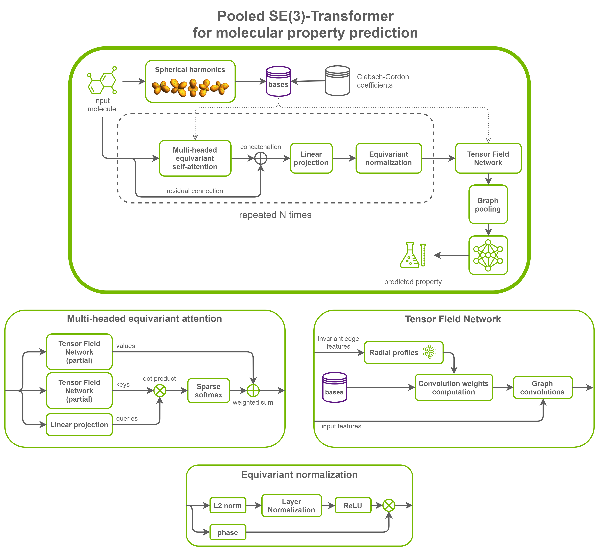

# PyTorch용 SE(3)-트랜스포머

이 저장소는 SE(3)-트랜스포머 모델을 학습시켜 최첨단 정확도를 달성하기 위한 스크립트와 레시피를 제공합니다. 이 저장소의 내용은 NVIDIA에서 테스트하고 유지 관리합니다.

## 목차
- [모델 개요](#모델-개요)
    * [모델 아키텍처](#모델-아키텍처)
    * [기본 구성](#기본-구성)
    * [기능 지원 매트릭스](#기능-지원-매트릭스)
        * [기능](#기능)
    * [혼합 정밀도 학습](#혼합-정밀도-학습)
        * [혼합 정밀도 활성화](#혼합-정밀도-활성화)
          * [TF32 활성화](#tf32-활성화)
    * [용어집](#용어집)
- [설정](#설정)
    * [요구사항](#요구사항)
- [빠른 시작 가이드](#빠른-시작-가이드)
- [고급](#고급)
    * [스크립트 및 샘플 코드](#스크립트-및-샘플-코드)
    * [매개변수](#매개변수)
    * [명령줄 옵션](#명령줄-옵션)
    * [데이터 가져오기](#데이터-가져오기)
        * [데이터셋 지침](#데이터셋-지침)
        * [다중 데이터셋](#다중-데이터셋)
    * [학습 과정](#학습-과정)
    * [추론 과정](#추론-과정)
- [성능](#성능)
    * [벤치마킹](#벤치마킹)
        * [학습 성능 벤치마크](#학습-성능-벤치마크)
        * [추론 성능 벤치마크](#추론-성능-벤치마크)
    * [결과](#결과)
        * [학습 정확도 결과](#학습-정확도-결과)
            * [학습 정확도: NVIDIA DGX A100 (8x A100 80GB)](#학습-정확도-nvidia-dgx-a100-8x-a100-80gb)
            * [학습 정확도: NVIDIA DGX-1 (8x V100 16GB)](#학습-정확도-nvidia-dgx-1-8x-v100-16gb)
            * [학습 안정성 테스트](#학습-안정성-테스트)
        * [학습 성능 결과](#학습-성능-결과)
            * [학습 성능: NVIDIA DGX A100 (8x A100 80GB)](#학습-성능-nvidia-dgx-a100-8x-a100-80gb)
            * [학습 성능: NVIDIA DGX-1 (8x V100 16GB)](#학습-성능-nvidia-dgx-1-8x-v100-16gb)
        * [추론 성능 결과](#추론-성능-결과)
            * [추론 성능: NVIDIA DGX A100 (1x A100 80GB)](#추론-성능-nvidia-dgx-a100-1x-a100-80gb)
            * [추론 성능: NVIDIA DGX-1 (1x V100 16GB)](#추론-성능-nvidia-dgx-1-1x-v100-16gb)
- [릴리스 노트](#릴리스-노트)
    * [변경 로그](#변경-로그)
    * [알려진 문제](#알려진-문제)


## 모델 개요


**SE(3)-트랜스포머**는 3D 포인트 및 그래프 처리를 위해 [셀프 어텐션](https://arxiv.org/abs/1706.03762v5)의 변형을 사용하는 그래프 신경망입니다.
이 모델은 [연속적인 3D 회전-이동](https://en.wikipedia.org/wiki/Euclidean_group)에 대해 [등변](https://en.wikipedia.org/wiki/Equivariant_map)입니다. 즉, 입력(그래프 또는 포인트 집합)이 3D 공간에서 회전할 때(또는 더 일반적으로 [적절한 강체 변환](https://en.wikipedia.org/wiki/Rigid_transformation)을 겪을 때), 모델 출력은 불변하거나 입력과 함께 변환됩니다.
등변성의 수학적 보장은 데이터 입력의 불필요한 변환이 있는 경우와 문제가 우리가 활용하고자 하는 일부 고유한 대칭성을 가질 때 안정적이고 예측 가능한 성능을 보장하는 데 중요합니다.


이 모델은 다음 간행물을 기반으로 합니다:
- [SE(3)-Transformers: 3D Roto-Translation Equivariant Attention Networks](https://arxiv.org/abs/2006.10503) (NeurIPS 2020) by Fabian B. Fuchs, Daniel E. Worrall, et al.
- [Tensor field networks: Rotation- and translation-equivariant neural networks for 3D point clouds](https://arxiv.org/abs/1802.08219) by Nathaniel Thomas, Tess Smidt, et al.

후속 논문은 이 모델을 반복적으로 사용하여 예를 들어 단백질 구조를 예측하거나 개선하는 방법을 설명합니다:

- [Iterative SE(3)-Transformers](https://arxiv.org/abs/2102.13419) by Fabian B. Fuchs, Daniel E. Worrall, et al.

[공식 구현](https://github.com/FabianFuchsML/se3-transformer-public)과 마찬가지로 이 구현은 [PyTorch](https://pytorch.org/)와 [Deep Graph Library (DGL)](https://www.dgl.ai/)를 사용합니다.

이 SE(3)-트랜스포머 구현과 공식 구현의 주요 차이점은 다음과 같습니다:

- 다중 GPU에 대한 학습 및 추론 지원
- [혼합 정밀도](https://arxiv.org/abs/1710.03740)에 대한 학습 및 추론 지원
- [DGL의 QM9 데이터셋](https://docs.dgl.ai/en/latest/api/python/dgl.data.html#qm9edge-dataset)이 사용되고 자동으로 다운로드됨
- 처리량 대폭 증가
- 메모리 소비량 대폭 감소
- 완전 연결 방사형 프로파일 레이어에서 레이어 정규화 사용은 옵션(`--use_layer_norm`), 기본적으로 꺼짐
- 어텐션 레이어 간 등변 정규화 사용은 옵션(`--norm`), 기본적으로 꺼짐
- 기저 행렬을 계산하는 데 사용되는 [구면 조화 함수](https://en.wikipedia.org/wiki/Spherical_harmonic) 및 [클렙쉬-고든 계수](https://en.wikipedia.org/wiki/Clebsch%E2%80%93Gordan_coefficients)는 [e3nn 라이브러리](https://e3nn.org/)로 계산됨


이 모델을 사용하면 [QM9 데이터셋](https://www.nature.com/articles/sdata201422)에 있는 작은 유기 분자의 양자 화학적 특성을 예측할 수 있습니다.
이 경우 활용되는 대칭성은 이러한 특성이 공간에서 분자의 방향이나 위치에 의존하지 않는다는 것입니다.


이 모델은 NVIDIA Volta, NVIDIA Turing 및 NVIDIA Ampere GPU 아키텍처에서 텐서 코어를 사용하여 혼합 정밀도로 학습됩니다. 따라서 연구원들은 혼합 정밀도 학습의 이점을 경험하면서 텐서 코어 없이 학습하는 것보다 최대 1.5배 빠른 결과를 얻을 수 있습니다. 이 모델은 시간이 지남에 따라 일관된 정확도와 성능을 보장하기 위해 매월 NGC 컨테이너 릴리스에 대해 테스트됩니다.

### 모델 아키텍처

모델은 등변 그래프 셀프 어텐션 및 등변 정규화의 스택된 레이어로 구성됩니다.
마지막으로, 불변 특징을 얻기 위해 텐서 필드 네트워크 컨볼루션이 적용됩니다. 그래프 풀링(노드에 대한 평균 또는 최대)이 이러한 특징에 적용되고, 그 결과는 스칼라 예측을 얻기 위해 최종 MLP에 공급됩니다.

이 설정에서 모델은 그래프-스칼라 네트워크입니다. 풀링을 제거하여 그래프-그래프 네트워크를 얻을 수 있으며, 최종 TFN은 모든 유형(불변 스칼라, 3D 벡터 등)의 특징을 출력하도록 수정할 수 있습니다.





### 기본 구성


SE(3)-트랜스포머는 3D 회전-이동에 등변인 그래프에 대한 셀프 어텐션 레이어를 도입합니다. 이는 텐서 필드 네트워크를 활용하여 불변인 어텐션 가중치와 등변인 어텐션 값을 구축함으로써 이를 달성합니다.
등변 값을 불변 가중치와 결합하면 등변 출력이 생성됩니다. 이 출력은 특징 노름에 작용하는 등변 정규화 레이어 덕분에 등변성을 유지하면서 정규화됩니다.


이 모델에는 다음 기능이 구현되었습니다:

- 모든 차수(1D, 3D, 5D 등)의 에지 특징 지원, 반면 공식 구현은 스칼라 불변 에지 특징(차수 0)만 지원합니다. 차수가 1보다 큰 에지 특징은
동일한 차수의 노드 특징에 연결됩니다. 이는 포인트 클라우드 처리에 대한 발표된 결과를 재현하기 위해 필요합니다.
- 데이터 병렬 다중 GPU 학습(DDP)
- 혼합 정밀도 학습(자동 캐스트, 그래디언트 스케일링)
- 그래디언트 누적
- 모델 체크포인팅


이 모델에는 다음과 같은 성능 최적화가 구현되었습니다:


**일반 최적화**

- 각 순방향 패스의 시작 부분에 계산하는 대신 학습 시작 부분에 기저를 미리 계산하는 옵션이 제공됩니다(`--precompute_bases`).
- 기저 계산은 `torch.jit.script`로 Just-In-Time(JIT) 컴파일됩니다.
- 클렙쉬-고든 계수는 RAM에 캐시됩니다.


**텐서 필드 네트워크 최적화**

- 각 방사형 프로파일 네트워크의 마지막 레이어는 큰 브로드캐스팅 작업을 피하기 위해 바이어스를 추가하지 않습니다.
- 기저 텐서의 레이아웃(차원 순서)은 다운스트림 TFN 레이어에서 연속 메모리로의 복사를 피하기 위해 최적화됩니다.
- 텐서 코어를 사용할 수 있고 계산된 기저의 출력 특징 차원이 홀수이면 텐서 코어를 더 효과적으로 사용하기 위해 0으로 채워집니다(AMP 및 TF32 정밀도).
- TFN 컨볼루션(및 방사형 프로파일)에 대한 여러 수준의 융합이 제공되며 조건이 충족되면 자동으로 사용됩니다.
- 처리량을 메모리 사용량 감소와 맞바꾸는 저메모리 모드가 제공됩니다(`--low_memory`).

**셀프 어텐션 최적화**

- 어텐션 키와 값은 각 어텐션 레이어에서 두 개 대신 단일 부분 TFN 그래프 컨볼루션으로 계산됩니다.
- 조건이 충족되면 다른 출력 차수에 대한 그래프 작업이 함께 융합될 수 있습니다.


**정규화 최적화**

- 등변 정규화 레이어는 특정 조건이 충족될 때 융합된 노름에 대한 그룹 정규화로 여러 레이어 정규화에서 최적화됩니다.


경쟁력 있는 학습 결과 및 분석은 다음 하이퍼파라미터(원래 간행물의 것과 동일)에 대해 제공됩니다:
- 레이어 수: 7
- 차수 수: 4
- 채널 수: 32
- 어텐션 헤드 수: 8
- 채널 분할: 2
- 등변 정규화 사용: 참
- 레이어 정규화 사용: 참
- 풀링: 최대


### 기능 지원 매트릭스

이 모델은 다음 기능을 지원합니다::

| 기능               | SE(3)-트랜스포머
|-----------------------|--------------------------
|자동 혼합 정밀도(AMP)   |         예
|분산 데이터 병렬(DDP)   |         예

#### 기능


**분산 데이터 병렬(DDP)**

[DistributedDataParallel (DDP)](https://pytorch.org/docs/stable/generated/torch.nn.parallel.DistributedDataParallel.html#torch.nn.parallel.DistributedDataParallel)는 여러 GPU 또는 머신에서 실행할 수 있는 모듈 수준에서 데이터 병렬 처리를 구현합니다.

**자동 혼합 정밀도(AMP)**

이 구현은 혼합 정밀도 학습의 기본 PyTorch AMP 구현을 사용합니다. 몇 줄의 코드만 수정하여 FP32 마스터 가중치로 FP16 학습을 사용할 수 있습니다. 혼합 정밀도에 대한 자세한 설명은 다음 섹션에서 찾을 수 있습니다.

### 혼합 정밀도 학습

혼합 정밀도는 계산 방법에서 다른 수치 정밀도를 함께 사용하는 것입니다. [혼합 정밀도](https://arxiv.org/abs/1710.03740) 학습은 네트워크의 중요한 부분에서 가능한 한 많은 정보를 유지하기 위해 단일 정밀도로 최소한의 정보를 저장하면서 반정밀도 형식으로 작업을 수행하여 상당한 계산 속도 향상을 제공합니다. NVIDIA Volta에서 [텐서 코어](https://developer.nvidia.com/tensor-cores)가 도입된 이래로 NVIDIA Turing 및 NVIDIA Ampere 아키텍처 모두에서 혼합 정밀도로 전환하면 상당한 학습 속도 향상을 경험할 수 있습니다. 가장 산술적으로 집약적인 모델 아키텍처에서 최대 3배의 전체 속도 향상이 있습니다. 이전에 [혼합 정밀도 학습](https://docs.nvidia.com/deeplearning/performance/mixed-precision-training/index.html)을 사용하려면 두 단계가 필요했습니다:
1.  적절한 경우 FP16 데이터 유형을 사용하도록 모델을 포팅합니다.
2.  작은 그래디언트 값을 보존하기 위해 손실 스케일링을 추가합니다.

AMP는 NVIDIA Volta, NVIDIA Turing 및 NVIDIA Ampere GPU 아키텍처에서 자동으로 혼합 정밀도 학습을 활성화합니다. PyTorch 프레임워크 코드는 내부적으로 모든 필요한 모델 변경을 수행합니다.

다음에 대한 정보:
-   혼합 정밀도를 사용하여 학습하는 방법은 [혼합 정밀도 학습](https://arxiv.org/abs/1710.03740) 논문 및 [혼합 정밀도로 학습](https://docs.nvidia.com/deeplearning/performance/mixed-precision-training/index.html) 설명서를 참조하십시오.
-   혼합 정밀도 학습에 사용되는 기술은 [딥 신경망의 혼합 정밀도 학습](https://devblogs.nvidia.com/mixed-precision-training-deep-neural-networks/) 블로그를 참조하십시오.
-   혼합 정밀도 학습을 위한 APEX 도구는 [NVIDIA Apex: PyTorch에서 쉬운 혼합 정밀도 학습을 위한 도구](https://devblogs.nvidia.com/apex-pytorch-easy-mixed-precision-training/)를 참조하십시오.

#### 혼합 정밀도 활성화

혼합 정밀도는 기본 [자동 혼합 정밀도 패키지](https://pytorch.org/docs/stable/amp.html)를 사용하여 PyTorch에서 활성화되며, 변수를 단일 정밀도 형식으로 저장하면서 검색 시 변수를 반정밀도로 캐스팅합니다. 또한 역전파에서 작은 그래디언트 크기를 보존하기 위해 그래디언트를 적용할 때 [손실 스케일링](https://docs.nvidia.com/deeplearning/sdk/mixed-precision-training/index.html#lossscaling) 단계를 포함해야 합니다. PyTorch에서는 `GradScaler`를 사용하여 손실 스케일링을 자동으로 적용할 수 있습니다.
자동 혼합 정밀도는 PyTorch 내부에서 모든 조정을 수행하여 수동 작업에 비해 두 가지 이점을 제공합니다. 첫째, 프로그래머는 네트워크 모델 코드를 수정할 필요가 없으므로 개발 및 유지 관리 노력이 줄어듭니다. 둘째, AMP를 사용하면 PyTorch 모델을 정의하고 실행하기 위한 모든 API와의 순방향 및 역방향 호환성이 유지됩니다.

혼합 정밀도를 활성화하려면 학습 또는 추론 스크립트를 실행할 때 `--amp` 플래그를 사용하면 됩니다.

#### TF32 활성화

TensorFloat-32(TF32)는 텐서 연산이라고도 하는 행렬 수학을 처리하기 위한 [NVIDIA A100](https://www.nvidia.com/en-us/data-center/a100/) GPU의 새로운 수학 모드입니다. A100 GPU의 텐서 코어에서 실행되는 TF32는 NVIDIA Volta GPU의 단일 정밀도 부동 소수점 수학(FP32)에 비해 최대 10배의 속도 향상을 제공할 수 있습니다.

TF32 텐서 코어는 일반적으로 정확도 손실 없이 FP32를 사용하는 네트워크의 속도를 높일 수 있습니다. 가중치 또는 활성화에 높은 동적 범위가 필요한 모델의 경우 FP16보다 더 강력합니다.

자세한 내용은 [A100 GPU의 TensorFloat-32, AI 학습, HPC 최대 20배 가속화](https://blogs.nvidia.com/blog/2020/05/14/tensorfloat-32-precision-format/) 블로그 게시물을 참조하십시오.

TF32는 NVIDIA Ampere GPU 아키텍처에서 지원되며 기본적으로 활성화되어 있습니다.


### 용어집

**차수(유형)**

모델에서 모든 특징(입력, 출력 및 숨겨진)은 입력 그래프와 관련하여 등변 방식으로 변환됩니다. 특징을 정의할 때 채널 수 외에 어떤 변환 규칙을 따를지 선택해야 합니다.

특징의 차수 또는 유형은 입력이 3D로 회전할 때 이 특징이 어떻게 변환되는지를 설명하는 양의 정수입니다.

이것은 다른 회전 순서의 [기약 표현](https://en.wikipedia.org/wiki/Irreducible_representation)과 관련이 있습니다.

특징의 차수는 차원성을 결정합니다. 유형 d 특징은 2d+1의 차원성을 가집니다.

몇 가지 일반적인 예는 다음과 같습니다:
- 차수 0: 회전에 불변인 1D 스칼라
- 차수 1: 3D 회전 행렬에 따라 회전하는 3D 벡터
- 차수 2: 5D [위그너-D 행렬](https://en.wikipedia.org/wiki/Wigner_D-matrix)에 따라 회전하는 5D 벡터. 이것들은 대칭적인 트레이스 없는 3x3 행렬을 나타낼 수 있습니다.

**파이버**

파이버는 다른 유형 또는 차수(양의 정수)의 특징 집합의 표현으로 볼 수 있으며, 여기서 각 특징 유형은 규칙에 따라 변환됩니다.

이 저장소에서 파이버는 차수를 키로, 채널 수를 값으로 하는 사전으로 볼 수 있습니다.

**다중도**

주어진 유형의 특징의 다중도는 이 특징의 채널 수입니다.

**텐서 필드 네트워크**

[텐서 필드 네트워크](https://arxiv.org/abs/1802.08219)는 [텐서 곱](https://en.wikipedia.org/wiki/Tensor_product) 덕분에 등변성을 유지하면서 다른 차수의 특징을 결합하고 새로운 특징을 생성할 수 있는 일종의 등변 그래프 컨볼루션입니다.

**등변성**

[등변성](https://en.wikipedia.org/wiki/Equivariant_map)은 입력에 대칭 변환을 적용한 다음 함수를 계산하는 것이 함수를 계산한 다음 출력에 변환을 적용하는 것과 동일한 결과를 생성한다는 것을 명시하는 모델 함수의 속성입니다.

SE(3)-트랜스포머의 경우 대칭 그룹은 연속적인 회전-이동 그룹(SE(3))입니다.

## 설정

다음 섹션에서는 SE(3)-트랜스포머 모델 학습을 시작하기 위해 충족해야 하는 요구사항을 나열합니다.

### 요구사항

이 저장소에는 PyTorch 21.07 NGC 컨테이너를 확장하고 일부 종속성을 캡슐화하는 Dockerfile이 포함되어 있습니다. 이러한 종속성 외에 다음 구성 요소가 있는지 확인하십시오:
- [NVIDIA Docker](https://github.com/NVIDIA/nvidia-docker)
- PyTorch 21.07+ NGC 컨테이너
- 지원되는 GPU:
    - [NVIDIA Volta 아키텍처](https://www.nvidia.com/en-us/data-center/volta-gpu-architecture/)
    - [NVIDIA Turing 아키텍처](https://www.nvidia.com/en-us/design-visualization/technologies/turing-architecture/)
    - [NVIDIA Ampere 아키텍처](https://www.nvidia.com/en-us/data-center/nvidia-ampere-gpu-architecture/)

NGC 컨테이너 시작 방법에 대한 자세한 내용은 NVIDIA GPU 클라우드 설명서 및 딥 러닝 설명서의 다음 섹션을 참조하십시오:
- [NVIDIA GPU 클라우드 사용 시작하기](https://docs.nvidia.com/ngc/ngc-getting-started-guide/index.html)
- [NGC 컨테이너 레지스트리에서 액세스 및 가져오기](https://docs.nvidia.com/deeplearning/frameworks/user-guide/index.html#accessing_registry)
- [PyTorch 실행](https://docs.nvidia.com/deeplearning/frameworks/pytorch-release-notes/running.html#running)

PyTorch NGC 컨테이너를 사용하여 필요한 환경을 설정하거나 자체 컨테이너를 만들 수 없는 경우 버전이 지정된 [NVIDIA 컨테이너 지원 매트릭스](https://docs.nvidia.com/deeplearning/frameworks/support-matrix/index.html)를 참조하십시오.

## 빠른 시작 가이드

텐서 코어 또는 FP32를 사용하여 혼합 또는 TF32 정밀도로 모델을 학습하려면 QM9 데이터셋에서 SE(3)-트랜스포머 모델의 기본 매개변수를 사용하여 다음 단계를 수행하십시오. 학습 및 추론에 관한 구체적인 내용은 [고급](#고급) 섹션을 참조하십시오.

1. 저장소를 복제합니다.
    ```
    git clone https://github.com/NVIDIA/DeepLearningExamples
    cd DeepLearningExamples/PyTorch/DrugDiscovery/SE3Transformer
    ```

2.  `se3-transformer` PyTorch NGC 컨테이너를 빌드합니다.
    ```
    docker build -t se3-transformer .
    ```

3.  학습/추론을 실행하기 위해 NGC 컨테이너에서 대화형 세션을 시작합니다.
    ```
    mkdir -p results
    docker run -it --runtime=nvidia --shm-size=8g --ulimit memlock=-1 --ulimit stack=67108864 --rm -v ${PWD}/results:/results se3-transformer:latest
    ```

4. 학습을 시작합니다.
   ```
   bash scripts/train.sh
   ```

5. 추론/예측을 시작합니다.
   ```
   bash scripts/predict.sh
   ```


이제 모델을 학습하고 평가했으므로 학습 결과를 [학습 정확도 결과](#학습-정확도-결과)와 비교할 수 있습니다. 또한 성능을 [학습 성능 벤치마크](#학습-성능-결과) 또는 [추론 성능 벤치마크](#추론-성능-결과)에 벤치마킹할 수도 있습니다. 이러한 섹션의 단계를 따르면 [결과](#결과) 섹션에 명시된 것과 동일한 정확도 및 성능 결과를 얻을 수 있습니다.

## 고급

다음 섹션에서는 데이터셋, 학습 및 추론 실행, 학습 결과에 대한 자세한 내용을 제공합니다.

### 스크립트 및 샘플 코드

루트 디렉토리에서 가장 중요한 파일은 다음과 같습니다:
- `Dockerfile`: SE(3)-트랜스포머를 실행하기 위한 기본 종속성 집합이 있는 컨테이너
- `requirements.txt`: SE(3)-트랜스포머를 실행하기 위한 추가 요구사항 집합
- `se3_transformer/data_loading/qm9.py`: QM9 데이터 로딩 및 전처리, 그리고 기저 사전 계산
- `se3_transformer/model/layers/`: 모델 아키텍처 레이어를 포함하는 디렉토리
- `se3_transformer/model/transformer.py`: 메인 트랜스포머 모듈
- `se3_transformer/model/basis.py`: 기저 행렬 계산 로직
- `se3_transformer/runtime/training.py`: 학습 스크립트, 파이썬 모듈로 실행
- `se3_transformer/runtime/inference.py`: 추론 스크립트, 파이썬 모듈로 실행
- `se3_transformer/runtime/metrics.py`: 다중 GPU 동기화를 지원하는 MAE 메트릭
- `se3_transformer/runtime/loggers.py`: [DLLogger](https://github.com/NVIDIA/dllogger) 및 [W&B](wandb.ai/) 로거


### 매개변수

`training.py` 스크립트에 사용할 수 있는 매개변수의 전체 목록은 다음과 같습니다:

**일반**

- `--epochs`: 학습 에포크 수 (기본값: 단일 GPU의 경우 `100`)
- `--batch_size`: 배치 크기 (기본값: `240`)
- `--seed`: 전역적으로 시드 설정 (기본값: `None`)
- `--num_workers`: 데이터 로딩 작업자 수 (기본값: `8`)
- `--amp`: 자동 혼합 정밀도 사용 (기본값 `false`)
- `--gradient_clip`: 그래디언트 노름 클리핑 (기본값: `None`)
- `--accumulate_grad_batches`: 그래디언트 누적 (기본값: `1`)
- `--ckpt_interval`: N 에포크마다 체크포인트 저장 (기본값: `-1`)
- `--eval_interval`: N 에포크마다 평가 라운드 수행 (기본값: `1`)
- `--silent`: stdout 출력 최소화 (기본값: `false`)

**경로**

- `--data_dir`: 데이터가 있거나 다운로드해야 하는 디렉토리 (기본값: `./data`)
- `--log_dir`: 결과 로그를 저장해야 하는 디렉토리 (기본값: `/results`)
- `--save_ckpt_path`: 체크포인트를 저장해야 하는 파일 (기본값: `None`)
- `--load_ckpt_path`: 로드할 체크포인트 파일 (기본값: `None`)

**옵티마이저**

- `--optimizer`: 사용할 옵티마이저 (기본값: `adam`)
- `--learning_rate`: 사용할 학습률 (기본값: 단일 GPU의 경우 `0.002`)
- `--momentum`: 사용할 모멘텀 (기본값: `0.9`)
- `--weight_decay`: 사용할 가중치 감쇠 (기본값: `0.1`)

**QM9 데이터셋**

- `--task`: 학습할 회귀 작업 (기본값: `homo`)
- `--precompute_bases`: 각 순방향 패스의 시작 부분에 계산하는 대신 데이터셋 초기화 중에 스크립트 시작 부분에 기저를 미리 계산합니다 (기본값: `false`).

**모델 아키텍처**

- `--num_layers`: 스택된 트랜스포머 레이어 수 (기본값: `7`)
- `--num_heads`: 셀프 어텐션의 헤드 수 (기본값: `8`)
- `--channels_div`: 어텐션 레이어에 공급하기 전 채널 분할 (기본값: `2`)
- `--pooling`: 그래프 풀링 유형 (기본값: `max`)
- `--norm`: 각 어텐션 블록 후에 정규화 레이어 적용 (기본값: `false`)
- `--use_layer_norm`: MLP 레이어 간에 레이어 정규화 적용 (기본값: `false`)
- `--low_memory`: 참인 경우 더 느리지만 메모리를 덜 사용하는 융합된 연산을 사용합니다(메모리 25% 감소 예상). AMP가 NVIDIA Volta GPU에서 활성화되거나 Ampere GPU에서 실행되는 경우에만 효과가 있습니다(기본값: `false`).
- `--num_degrees`: 사용할 차수 수. 숨겨진 특징은 [0, ..., num_degrees - 1] 유형을 가집니다 (기본값: `4`).
- `--num_channels`: 숨겨진 특징의 채널 수 (기본값: `32`)


### 명령줄 옵션

사용 가능한 옵션 및 설명의 전체 목록을 보려면 `-h` 또는 `--help` 명령줄 옵션을 사용하십시오. 예: `python -m se3_transformer.runtime.training --help`.


### 데이터셋 지침

#### 데모 데이터셋

SE(3)-트랜스포머는 QM9 데이터셋에서 학습되었습니다.

QM9 데이터셋은 DGL 서버에서 호스팅되며 필요할 때 자동으로 다운로드됩니다(38MB). 기본적으로 `./data` 디렉토리에 저장되지만 이 위치는 `--data_dir` 인수로 변경할 수 있습니다.

데이터셋은 `qm9_edge.npz` 파일로 저장되고 런타임에 DGL 그래프로 변환됩니다.

입력 특징으로 다음을 사용합니다:
- 노드 특징(6D):
    - 원-핫 인코딩된 원자 유형(5D) (원자 유형: H, C, N, O, F)
    - 각 원자의 양성자 수(1D)
- 에지 특징: 원-핫 인코딩된 결합 유형(4D) (결합 유형: 단일, 이중, 삼중, 방향족)
- 인접 노드(원자) 간의 상대 위치

#### 사용자 지정 데이터셋

이 네트워크를 새 데이터셋에서 사용하려면 `se3_transformer/data_loading/data_module.py`에 있는 `DataModule` 클래스를 확장할 수 있습니다.

사용자 지정 데이터 정렬 함수는 다음을 포함하는 튜플을 반환해야 합니다:

- (배치된) DGLGraph 객체
- 노드 특징 사전({‘{degree}’: tensor})
- 에지 특징 사전({‘{degree}’: tensor})
- (선택 사항) 사전으로서의 사전 계산된 기저
- 텐서로서의 레이블

그런 다음 `training.py` 및 `inference.py` 스크립트를 수정하여 새 데이터 모듈을 사용할 수 있습니다.

### 학습 과정

학습 스크립트는 `se3_transformer/runtime/training.py`이며 모듈로 실행됩니다: `python -m se3_transformer.runtime.training`.

**로그**

기본적으로 결과 로그는 `/results/`에 저장됩니다. 이것은 `--log_dir`로 변경할 수 있습니다.

`WANDB_API_KEY` 환경 변수를 설정하여 기존 Weights & Biases 계정을 연결할 수 있습니다.

**체크포인트**

`--save_ckpt_path` 인수는 체크포인트를 저장해야 하는 파일의 경로로 설정할 수 있습니다.
`--ckpt_interval`은 체크포인트 간의 간격(에포크 수)으로 설정할 수도 있습니다.

**평가**

평가 메트릭은 평균 절대 오차(MAE)입니다.

`--eval_interval`은 평가 라운드 간의 간격(에포크 수)으로 설정할 수 있습니다. 기본적으로 각 에포크 후에 평가 라운드가 수행됩니다.

**자동 혼합 정밀도**

혼합 정밀도 학습을 활성화하려면 `--amp` 플래그를 추가하십시오.

**다중 GPU 및 다중 노드**

학습 스크립트는 PyTorch 탄력적 실행기를 지원하여 여러 GPU 또는 노드에서 실행할 수 있습니다. [공식 문서](https://pytorch.org/docs/1.9.0/elastic/run.html)를 참조하십시오.

예를 들어, AMP를 사용하여 사용 가능한 모든 GPU에서 학습하려면:

```
python -m torch.distributed.run --nnodes=1 --nproc_per_node=gpu --module se3_transformer.runtime.training --amp
```


### 추론 과정

추론은 `se3_transformer.runtime.inference` 파이썬 모듈을 사용하여 실행할 수 있습니다.

추론 스크립트는 `se3_transformer/runtime/inference.py`이며 모듈로 실행됩니다: `python -m se3_transformer.runtime.inference`. 사전 학습된 모델 체크포인트가 필요합니다(`--load_ckpt_path`로 전달).


## 성능

이 문서의 성능 측정은 게시 시점에 수행되었으며 NVIDIA의 최신 소프트웨어 릴리스에서 달성된 성능을 반영하지 않을 수 있습니다. 가장 최신 성능 측정값은 [NVIDIA 데이터 센터 딥 러닝 제품 성능](https://developer.nvidia.com/deep-learning-performance-training-inference)으로 이동하십시오.

### 벤치마킹

다음 섹션에서는 학습 및 추론 모드에서 모델 성능을 측정하는 벤치마크를 실행하는 방법을 보여줍니다.

#### 학습 성능 벤치마크

특정 배치 크기에서 학습 성능을 벤치마킹하려면 단일 GPU의 경우 `bash scripts/benchmarck_train.sh {BATCH_SIZE}`를 실행하고 다중 GPU의 경우 `bash scripts/benchmarck_train_multi_gpu.sh {BATCH_SIZE}`를 실행하십시오.

#### 추론 성능 벤치마크

특정 배치 크기에서 추론 성능을 벤치마킹하려면 `bash scripts/benchmarck_inference.sh {BATCH_SIZE}`를 실행하십시오.

### 결과


다음 섹션에서는 학습 및 추론에서 성능 및 정확도를 달성한 방법에 대한 자세한 내용을 제공합니다.

#### 학습 정확도 결과

##### 학습 정확도: NVIDIA DGX A100 (8x A100 80GB)

우리의 결과는 PyTorch 21.07 NGC 컨테이너에서 NVIDIA DGX A100 (8x A100 80GB) GPU에서 `scripts/train.sh` 학습 스크립트를 실행하여 얻었습니다.

| GPU 수    | GPU당 배치 크기    | 절대 오차 - TF32  | 절대 오차 - 혼합 정밀도  |   학습 시간 - TF32  |  학습 시간 - 혼합 정밀도 | 학습 시간 속도 향상(혼합 정밀도 대 TF32) |
|:------------------:|:----------------------:|:--------------------:|:------------------------------------:|:---------------------------------:|:----------------------:|:----------------------------------------------:|
|  1                 |    240                   |           0.03456                            |        0.03460                                |        1h23min      |    1h03min                |    1.32x              |
|  8                 |    240                   |           0.03417                            |        0.03424                                |        15min          |    12min                |    1.25x              |


##### 학습 정확도: NVIDIA DGX-1 (8x V100 16GB)

우리의 결과는 PyTorch 21.07 NGC 컨테이너에서 NVIDIA DGX-1 (8x V100 16GB) GPU에서 `scripts/train.sh` 학습 스크립트를 실행하여 얻었습니다.

| GPU 수    | GPU당 배치 크기    | 절대 오차 - FP32  | 절대 오차 - 혼합 정밀도  |   학습 시간 - FP32  |  학습 시간 - 혼합 정밀도 | 학습 시간 속도 향상(혼합 정밀도 대 FP32)  |
|:------------------:|:----------------------:|:--------------------:|:------------------------------------:|:---------------------------------:|:----------------------:|:----------------------------------------------:|
|  1                 |    240                   |           0.03432                            |        0.03439                                |         2h25min         |    1h33min                |    1.56x              |
|  8                 |    240                   |           0.03380                            |        0.03495                                |        29min          |    20min                |    1.45x              |


#### 학습 성능 결과

##### 학습 성능: NVIDIA DGX A100 (8x A100 80GB)

우리의 결과는 PyTorch 21.07 NGC 컨테이너에서 NVIDIA DGX A100 8x A100 80GB GPU에서 `scripts/benchmark_train.sh` 및 `scripts/benchmark_train_multi_gpu.sh` 벤치마킹 스크립트를 실행하여 얻었습니다. 성능 수치(밀리초당 분자 수)는 워밍업 에포크 후 5개 전체 학습 에포크에 대해 평균을 냈습니다.

| GPU 수             | GPU당 배치 크기     | 처리량 - TF32 [mol/ms]                             | 처리량 - 혼합 정밀도 [mol/ms]      | 처리량 속도 향상(혼합 정밀도 - TF32)   | 약한 확장 - TF32    | 약한 확장 - 혼합 정밀도 |
|:------------------:|:----------------------:|:--------------------:|:------------------------------------:|:---------------------------------:|:----------------------:|:----------------------------------------------:|
|   1              |     240             |   2.21                                       |   2.92                            |   1.32x                         |                      |                                              |
|   1              |     120              |  1.81                                        |  2.04                             |  1.13x                          |                      |                                              |
|   8              |     240             |   17.15                                      |     22.95                         |   1.34x                         |   7.76               |    7.86                                     |
|   8              |     120              |  13.89                                       |    15.62                          |  1.12x                          |       7.67           |    7.66                                       |


이러한 동일한 결과를 얻으려면 [빠른 시작 가이드](#빠른-시작-가이드)의 단계를 따르십시오.


##### 학습 성능: NVIDIA DGX-1 (8x V100 16GB)

우리의 결과는 PyTorch 21.07 NGC 컨테이너에서 NVIDIA DGX-1 8x V100 16GB GPU에서 `scripts/benchmark_train.sh` 및 `scripts/benchmark_train_multi_gpu.sh` 벤치마킹 스크립트를 실행하여 얻었습니다. 성능 수치(밀리초당 분자 수)는 워밍업 에포크 후 5개 전체 학습 에포크에 대해 평균을 냈습니다.

| GPU 수             | GPU당 배치 크기     | 처리량 - FP32 [mol/ms] | 처리량 - 혼합 정밀도  [mol/ms]     | 처리량 속도 향상(FP32 - 혼합 정밀도)   | 약한 확장 - FP32    | 약한 확장 - 혼합 정밀도 |
|:------------------:|:----------------------:|:--------------------:|:------------------------------------:|:---------------------------------:|:----------------------:|:----------------------------------------------:|
|   1              |     240              |    1.25          |    1.88                           |  1.50x                          |                      |                                              |
|   1              |     120              |    1.03           |   1.41                            |  1.37x                          |                      |                                              |
|   8              |     240              |    9.33           |   14.02                           |  1.50x                          |      7.46            |      7.46                                    |
|   8              |     120              |    7.39           |   9.41                           |   1.27x                         |        7.17          |        6.67                                  |


이러한 동일한 결과를 얻으려면 [빠른 시작 가이드](#빠른-시작-가이드)의 단계를 따르십시오.


#### 추론 성능 결과


##### 추론 성능: NVIDIA DGX A100 (1x A100 80GB)

우리의 결과는 PyTorch 21.07 NGC 컨테이너에서 NVIDIA DGX A100 1x A100 80GB GPU에서 `scripts/benchmark_inference.sh` 추론 벤치마킹 스크립트를 실행하여 얻었습니다.

FP16

| 배치 크기 | 평균 처리량 [mol/ms] | 평균 지연 시간 [ms] | 지연 시간 90% [ms] |지연 시간 95% [ms] |지연 시간 99% [ms] |
|:------------:|:------:|:-----:|:-----:|:-----:|:-----:|
| 1600 | 11.60 | 140.94 | 138.29 | 140.12 | 386.40 |
| 800 | 10.74 | 75.69 | 75.74 | 76.50 | 79.77 |
| 400 | 8.86 | 45.57 | 46.11 | 46.60 | 49.97 |

TF32

| 배치 크기 | 평균 처리량 [mol/ms] | 평균 지연 시간 [ms] | 지연 시간 90% [ms] |지연 시간 95% [ms] |지연 시간 99% [ms] |
|:------------:|:------:|:-----:|:-----:|:-----:|:-----:|
| 1600 | 8.58 | 189.20 | 186.39 | 187.71 | 420.28 |
| 800 | 8.28 | 97.56 | 97.20 | 97.73 | 101.13 |
| 400 | 7.55 | 53.38 | 53.72 | 54.48 | 56.62 |

이러한 동일한 결과를 얻으려면 [빠른 시작 가이드](#빠른-시작-가이드)의 단계를 따르십시오.


##### 추론 성능: NVIDIA DGX-1 (1x V100 16GB)

우리의 결과는 PyTorch 21.07 NGC 컨테이너에서 NVIDIA DGX-1 1x V100 16GB GPU에서 `scripts/benchmark_inference.sh` 추론 벤치마킹 스크립트를 실행하여 얻었습니다.

FP16

| 배치 크기 | 평균 처리량 [mol/ms] | 평균 지연 시간 [ms] | 지연 시간 90% [ms] |지연 시간 95% [ms] |지연 시간 99% [ms] |
|:------------:|:------:|:-----:|:-----:|:-----:|:-----:|
| 1600 | 6.42 | 254.54 | 247.97 | 249.29 | 721.15 |
| 800 | 6.13 | 132.07 | 131.90 | 132.70 | 140.15 |
| 400 | 5.37 | 75.12 | 76.01 | 76.66 | 79.90 |

FP32

| 배치 크기 | 평균 처리량 [mol/ms] | 평균 지연 시간 [ms] | 지연 시간 90% [ms] |지연 시간 95% [ms] |지연 시간 99% [ms] |
|:------------:|:------:|:-----:|:-----:|:-----:|:-----:|
| 1600 | 3.39 | 475.86 | 473.82 | 475.64 | 891.18 |
| 800 | 3.36 | 239.17 | 240.64 | 241.65 | 243.70 |
| 400 | 3.17 | 126.67 | 128.19 | 128.82 | 130.54 |


이러한 동일한 결과를 얻으려면 [빠른 시작 가이드](#빠른-시작-가이드)의 단계를 따르십시오.


## 릴리스 노트

### 변경 로그

2021년 8월
- 최초 릴리스

### 알려진 문제

데이터 로더 반복자 생성 중(더 정확하게는 `fork()` 중) `OSError: [Errno 12] 메모리를 할당할 수 없습니다`가 발생하면 `--precompute_bases` 플래그 사용 때문일 가능성이 큽니다. 머신에 RAM 또는 스왑을 더 추가할 수 없는 경우 `--precompute_bases` 플래그를 제거하거나 `--precompute_bases false`를 사용하여 기저 사전 계산을 끄는 것이 좋습니다.
